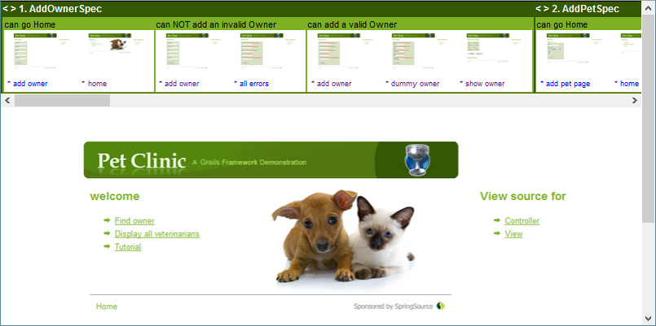

:numbered!:

[appendix]
== Example Reports

Currently there is only one example which is based on the Pet Clinic sample application.

the modified grails pet-clinic project to generate above report can be found at

* https://github.com/rdmueller/grails-petclinic/tree/film-strip-plugin-2.2[Pet-Clinic (Grails 2.2)]
* https://github.com/rdmueller/grails-petclinic/tree/film-strip-plugin-2.4[Pet-Clinic (Grails 2.4)]

